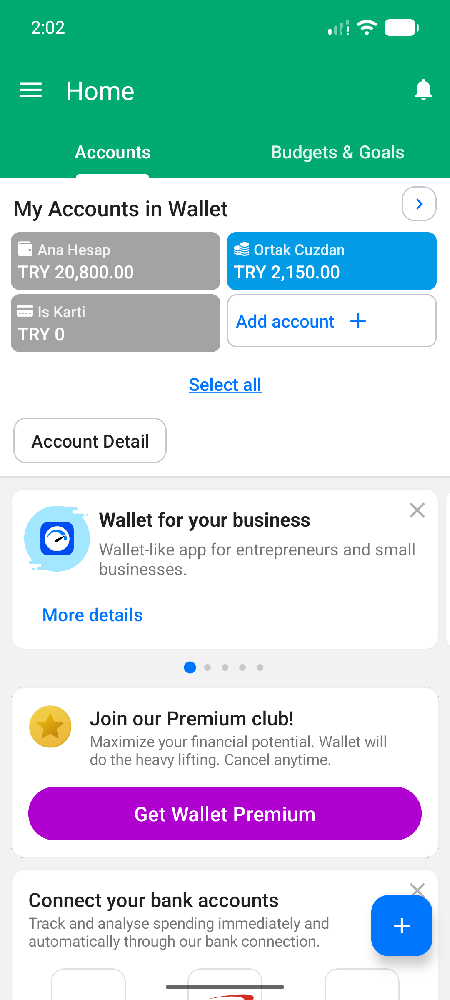
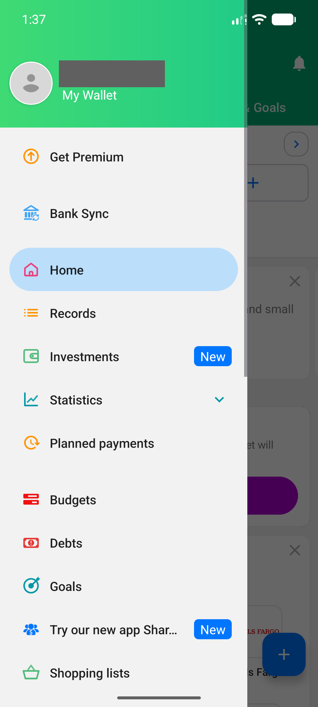
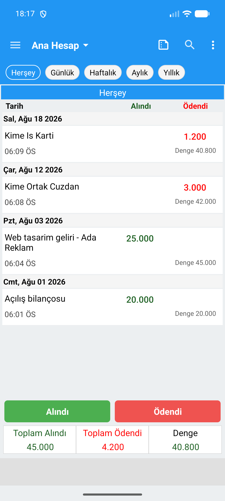
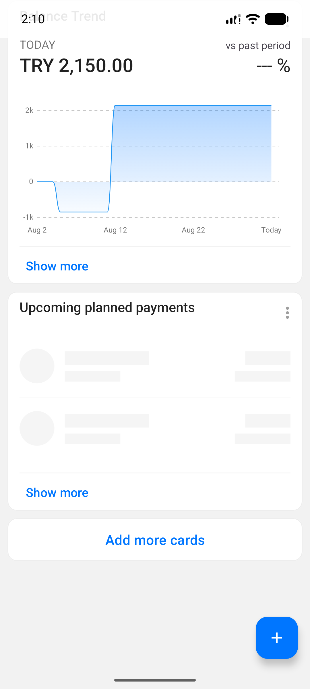
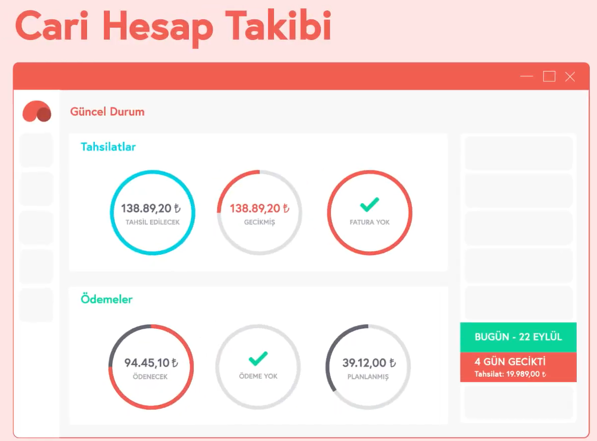
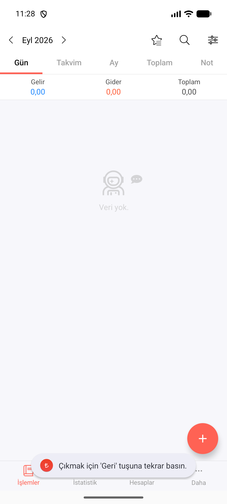
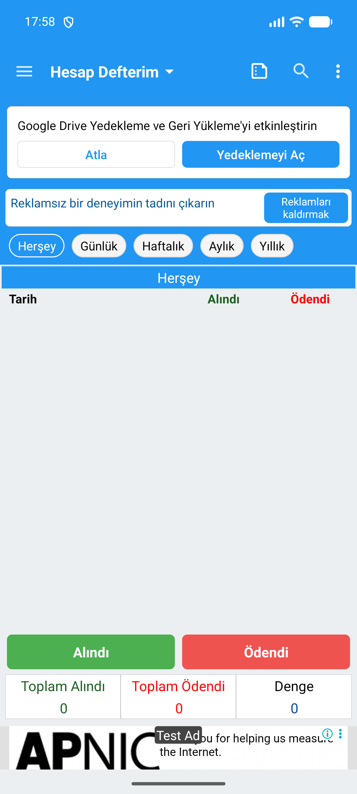

# 3 · Gezinme ve ana ekran

Belge 1 · Rakip arayüz yaklaşımları · Bağımsız taslak · 16 Eylül 2026

Bir ana ekranı karşılaştırırken üç farklı şeyi ayırmak gerekir: ekranda öne çıkan bilgi, başka bir bölüme geçiş ve yeni bir işe başlama. Aynı + simgesini taşıyan iki ürün, kullanıcıya bütçe zarfları veya hesap bakiyeleriyle karşılık verebilir. Bu bölüm, bu ayrımları incelenen yüzeyler üzerinden anlatır.

## Bölümün okuma haritası

3.1 İlk bilgi · 3.2 Bölümler arasında gezinme · 3.3 Kayıt başlatma · 3.4 Bekleyen işler · 3.5 İlk kullanım · 3.6 Boş ekran.

Her karşılaştırma aynı soruyu ürünlere yöneltir. Görseller bütün ekranları sergilemek için değil, anlatılan ayrımı göstermek için seçilmiştir. E ile başlayan kimlikler araştırmanın sabit kanıt numaralarıdır; şekil numaraları yalnız bu bağımsız bölüm içindir.

| Ürün ve platform | Bu bölümde kullanılabilen kanıt | Erişim sınırı |
|---|---|---|
| Money Manager · Android | Canlı koşum kareleri ve gözlem kaydı | İlk açılış yalnız kullanıcı tarafından doğrulanan kayıtta. |
| Bluecoins · Android | Canlı koşum kareleri ve gözlem kaydı | Veri varken açılışta seçilen sekme bilinmiyor. |
| Wallet · Android | Canlı koşum kareleri ve gözlem kaydı | Önceden açılmış hesap; ilk kurulum görülmedi. |
| Hesap Defterim · Android | Canlı koşum kareleri ve gözlem kaydı | Çok defterli kullanımda açılış seçimi bilinmiyor. |
| Goodbudget · Android | Canlı koşum kareleri ve gözlem kaydı | Kurulumu atlama denenmedi; boş ana ekran yok. |
| KolayBi · web | Resmî destek ekranları ve video kareleri | Güncel sürüm ve canlı davranış doğrulanmadı. |
| Paraşüt · mobil / tanıtım | Mobil giriş kaydı; masaüstü panosunun temsili çizimi | Çizim, çalışan ana ekran kanıtı değildir. |
| Logo İşbaşı · mobil | Giriş/kayıt yüzeyi kaydı | İç gezinme ve ana ekran görülmedi. |
| QuickBooks Solopreneur | Bu konu için doğrudan arayüz kanıtı yok | QBO Simple Start giriş kareleri Solopreneur'e aktarılmaz. |

**Kanıtı nasıl okumalı?** Canlı kare görünümü, koşum kaydı izlenen yolu anlatır. Kaynak ekranı veya temsili çizim ürünün kendi sunumudur; denenmiş davranış sayılmaz. “Görülmedi” bir bilgi boşluğudur. Bir ürünün canlı incelenmesi, o ürün hakkındaki bütün ifadeleri doğrulanmış kılmaz.

Bu bölüm hesaplama sonuçlarını, görev süresini ve kullanıcı başarısını değerlendirmez. Kayıtların finansal etkisi Belge 2'ye, BusinessFinance için tercihler Belge 3'e aittir. Kaynak tarihleri ve ürün sürümleri gözlem formlarında; bu metin Eylül 2026 araştırma korpusunu anlatır, güncel ürün denetimi değildir.

<!-- page -->

## 3.1 Ana ekranda önce hangi bilgi sunuluyor?

İncelenen yüzeyler aynı soruya cevap vermiyor: bazısı dönemin hareketlerini, bazısı paranın bulunduğu hesapları, bazısı bütçenin dağılımını öne alıyor. Bu ayrım ekrandaki ilk bilgi bloklarında görülebiliyor; ürünün niyetine veya kullanıcının tercihine dair bir ölçüm değil.

| Ürün ve platform | Görünen düzen | Dayanak ve sınır |
|---|---|---|
| Money Manager · Android | Ay seçimi → Gelir/Gider/Toplam → gün gruplu hareketler. | Canlı kare E0228. Hesaplar ayrı yüzeyde: E0236. |
| Bluecoins · Android | Hesaplar sekmesinde Günlük Özet → reklam → Bütçe Özeti. | Canlı kare E0103. Bu, dolu hesabın açılış sekmesini kanıtlamaz. |
| Wallet · Android | Home / Accounts içinde hesap kartları → ürün ve üyelik tanıtımları. | Canlı kare E0276; sayfanın aşağısı 3.4'te. |
| Hesap Defterim · Android | Seçili defterin hareketleri; altta Alındı/Ödendi/Denge toplamları. | Canlı kare E0137. Seçili defter ile bütün defterlerin toplamı eşitlenmez. |
| Goodbudget · Android | ENVELOPES içinde Monthly zarfları ve Available grubu. | Canlı kare E0115. Zarf satırındaki iki tutar etiketsiz. |
| KolayBi · web | Güncel Durum: grafik, tahsilat/ödeme özetleri ve günü gelen işler. | Destek görseli E0211. Platform ve sürüm sınırı var. |
| Paraşüt · masaüstü temsili | Tahsilatlar ve Ödemeler başlıklı halka grupları. | Tanıtım çizimi E0262. Gerçek ekran olduğu doğrulanmadı. |

<!-- gallery -->

<!-- /gallery -->

**Ayrım:** “Ana ekranda toplam var” ifadesi tek başına yeterli değil. Toplamın yanındaki başlık, dönem ve gösterilen nesne de kaydedilmelidir. Burada tutarların finansal anlamı veya birbirine denkliği doğrulanmıyor.

<!-- page -->

## 3.2 Kullanıcı diğer bölümleri nerede buluyor?

Gezinmede iki katman ayrı okunmalı: ana bölümler arasındaki geçiş ve bir bölümün kendi görünümleri. Örneğin Money Manager'ın alt sekmeleri ile Gün/Takvim/Ay sırası aynı düzeyde değil.

| Ürün ve platform | Görünen düzen | Dayanak ve sınır |
|---|---|---|
| Money Manager · Android | İşlemler/İstatistik/Hesaplar/Daha alt sırası; İşlemler içinde ayrıca zaman görünümleri. | E0228, E0231, E0236, E0254. Aynı alt sıra incelenen dört ana bölümde var; bütün alt formlar için iddia yok. |
| Bluecoins · Android | Üstte kaydırılan sekmeler; ayrıca sol menü. | E0103, E0084. Menüdeki iki Hesaplar kaleminin hedefleri açılmadı. |
| Wallet · Android | Sol menüde Home, Records, Statistics, Planned payments ve diğer hedefler; Home içinde iki sekme. | E0275, E0276, E0376. Menü hedeflerinin hepsi denenmedi. |
| Hesap Defterim · Android | Sol menü; başlıkta ayrıca defter seçici. | E0171, E0137. Defter seçimi ile modül seçimi ayrı kontroller. |
| Goodbudget · Android | ENVELOPES / TRANSACTIONS / ACCOUNTS / REPORTS üst sırası. | E0115. Bu karedeki dört etiket doğrulanır. |
| KolayBi · web | Solda modül paneli; panoda Güncel Durum / Stok Akışı / Notlar. | Destek görseli E0211; tıklama sonucu denenmedi. |

<!-- gallery -->

<!-- /gallery -->

**Sınır:** Paraşüt çiziminde menü alanları boş; Logo İşbaşı ve Solopreneur iç gezinmesi görülmedi. Bu boşluklar “menü yok” diye doldurulamaz. Menü uzunluğundan bulunabilirlik veya işlem hızı sonucu çıkarılmadı.

<!-- page -->

## 3.3 Yeni kayıt nereden başlatılıyor?

Kayıt düğmesinin yeri ile kullanıcının niyetini ne zaman adlandırdığı iki ayrı gözlem. İncelenen dört mobil ana ekranda + simgesi var; Hesap Defterim para yönünü başlangıç düğmesinin üzerine yazıyor.

| Ürün ve platform | Görünen düzen | Dayanak ve sınır |
|---|---|---|
| Money Manager · Android | Ana ekranın sağ altında +. | Canlı kare E0228; Şekil 3.1. |
| Bluecoins · Android | Sağ altta +; temiz başlangıçta İlk İşlemi Ekle kartı da var. | E0103, E0026. İki farklı veri durumu. |
| Wallet · Android | Home'un sağ altında +. | E0276; Şekil 3.2. |
| Goodbudget · Android | ENVELOPES sağ altında +. | E0115; Şekil 3.3. |
| Hesap Defterim · Android | Alındı / Ödendi düğmeleri; aktarım menüdeki Aktar kaleminde. | E0137, E0171. İki yön ile aktarımın girişleri farklı. |
| KolayBi · web | Pano üstünde Hızlı İşlemler kontrolü. | Destek görseli E0211. Kapalı menünün seçenekleri bu kareden bilinmiyor. |

<!-- gallery -->

<!-- /gallery -->

**Sınır:** + simgesinin varlığı her işlem türü için aynı akışın çalıştığını kanıtlamaz. Form karelerindeki tür seçenekleri de kullanıcının her kayıtta ayrıca seçim yapmak zorunda olduğunu göstermez; varsayılan tür bu bölümde doğrulanmadı. Alanların sırası ve kaydetme geri bildirimi işlem formu bölümünün konusudur.

<!-- page -->

## 3.4 Bekleyen işler ana ekrana nasıl bağlanıyor?

Wallet'ın Home sayfasının aşağısında planlı ödeme kartı görülüyor. Bluecoins örneğinde ise Hatırlatıcılar kendi sekmesinde. İkisi de gelecekteki veya vadesi gelmiş kayıtların görünür bir yerini gösterir; bunların gerçekleşme ve bakiyeye yansıma kuralları bu bölümün dışındadır.

| Ürün ve platform | Görünen düzen | Dayanak ve sınır |
|---|---|---|
| Wallet · Android | Balance Trend altında Upcoming planned payments; ardından Add more cards. | E0274. Planlı ödeme alanı yükleniyor görünümünde; satır içeriği doğrulanmadı. |
| Bluecoins · Android | Hatırlatıcılar sekmesinde tarih grupları; Dün bitti ve Bugün süresi doluyor etiketleri. | E0056. Bir sekmenin varlığı, ana panoda hiçbir başka gösterim olmadığı anlamına gelmez. |
| Money Manager · Android | İncelenen gün listesinde ayrı bekleyen işler alanı görünmüyor. | E0228 ile sınırlı; ürün genelinde özellik yokluğu iddia edilmez. |
| Hesap Defterim · Android | Seçili defter yüzeyinde bekleyen işler bölümü görülmüyor. | E0137. E0007 B1 taramasında da planlı kayıt bulunamadı; tarama sınırı korunur. |
| Goodbudget · Android | ENVELOPES karesinde bekleyen işler alanı görülmüyor. | E0115 ile sınırlı; başka yüzeyler hakkında sonuç yok. |

<!-- gallery -->

<!-- /gallery -->

**Karşılaştırma sonucu:** “Beş canlı üründe de bekleyen işler ana ekranda yok” denemez. Wallet karesi bu genellemeyi çürütür. Kanıt, kartın yerini gösterir; kartın yüklenmiş içeriğini veya işin tamamlanmasını göstermez.

<!-- page -->

### 3.4 devam · Kaynak panolarında vade sunumu

Aynı soru kaynak yüzeylerine yöneltildiğinde vade başlıkları pano düzeninin bir parçası olarak görülüyor. Aşağıdaki iki örneğin kanıt türü farklıdır.

| Ürün ve platform | Görünen düzen | Dayanak ve sınır |
|---|---|---|
| KolayBi · web | Grafik ve Tahsilat Ve Ödeme Özetleri yanında Günü Gelen İşlemler: Bugün, Yaklaşanlar, Tarihi Geçenler. | E0211 destek görseli. E0181 videosunda da vade grupları var; kaynak sürümleri doğrulanmadı. |
| Paraşüt · masaüstü temsili | Tahsilatlar/Ödemeler halkaları; gecikmiş ve planlanmış etiketleri, tarih/uyarı alanı. | E0262 tanıtım çizimi. Menü yerleri boş; gerçek uygulama ekranı olduğu doğrulanmadı. |

<!-- wide -->

<!-- /wide -->

**Sınır:** KolayBi'nin destek ve video kaynakları farklı pano parçaları içeriyor; tek bir güncel ekran olarak birleştirilmedi. Paraşüt çizimindeki tutarlar finansal senaryo sonucu sayılmadı. Masaüstü alanını kullanan bu yerleşimler mobil ekranlarla aynı yoğunluk koşullarında incelenmedi.

<!-- page -->

## 3.5 İlk kullanımda kullanıcı neyle karşılaşıyor?

Karşılama görmek, hesap açmak ve bütçe kurmak aynı adım değildir. Buradaki karşılaştırma yalnız kaydedilen başlangıç yollarını kapsar; atlanabilirlik ve bütün alternatif girişler sınanmadı.

| Ürün ve platform | Görünen düzen | Dayanak ve sınır |
|---|---|---|
| Money Manager · Android | Kullanıcının kaydına göre kayıt/karşılama olmadan ana ekran açıldı. | E0010 K00; ilk açılış görüntüsü yok. |
| Bluecoins · Android | Karşılama, dil seçici ve Hadi Başlayalım. | Canlı kare E0017. |
| Wallet · Android | İlk kurulum görülmedi; daha önce açılmış hesap kullanıldı. | E0014 K00. Açılış zorunlulukları bilinmiyor. |
| Hesap Defterim · Android | Hazır defterin üzerinde kullanım açıklaması. Koşumda kayıt istenmedi. | E0135 ve E0007 K00. Yardım ile düğme adları uyuşmuyor. |
| Goodbudget · Android | LOG IN / CREATE NEW HOUSEHOLD; izlenen yeni hane yolunda bütçe kurulumu ve sonra kayıt ekranı. | E0106, E0006 K00. Kayıt ekranındaki LATER denenmedi. |

<!-- gallery -->

<!-- /gallery -->

**Önemli ayrıntı:** Hesap Defterim açıklamasında Ücretli/Alınan, düğmelerde Ödendi/Alındı yazıyor (E0135). Goodbudget için “kurulum zorunludur” sonucu çıkarılmadı. Paraşüt ve Logo İşbaşı giriş sınırında kaldı; QuickBooks mobil/QBO giriş yolu Solopreneur başlangıcı olarak kullanılmadı (E0011, E0009, E0012).

<!-- page -->

## 3.6 Veri yokken ekran neyi koruyor?

Boşluk tek bir durum değil. İlk kez açılan bir ürün, hareket bulunmayan bir ay ve boş bir defter farklı bağlamlardır. Görseller bu bağlamları eşitlemeden okunmalı.

| Ürün ve platform | Görünen düzen | Dayanak ve sınır |
|---|---|---|
| Money Manager · Android | Eylül gün görünümünde sıfır özetler ve Veri yok.; + görünür kalıyor. | E0227: veri girilmiş uygulamanın boş ayı. İlk kayıt yönlendirmesi görünmüyor; alttaki geçici mesaj geri tuşuyla çıkışa ilişkin. |
| Bluecoins · Android | Temiz başlangıçta Hoş geldiniz, sıfır bakiye ve ekranın altına uzanan İlk İşlemi Ekle kartı. | E0026. E0018'deki boş kartlar başka bir görünüm; aynı an sayılmaz. |
| Hesap Defterim · Android | Liste başlıkları, Alındı/Ödendi düğmeleri ve sıfır toplamlar; yedekleme/reklam alanları da var. | E0136: boş defter. Kaydı başlatan düğmeler mevcut. |
| Wallet / Goodbudget · Android | Boş ana ekran için doğrudan örnek yok. | E0014 K00, E0006 K00. Yokluk değil, kanıt sınırı. |

<!-- gallery -->

<!-- /gallery -->

**Ayrım:** Kayıt ekleme kontrolünün görünmesi ile açıklayıcı bir ilk adım metni bulunması ayrı gözlemlerdir. Money Manager veya Hesap Defterim için “kullanıcıya hiçbir başlangıç sunulmuyor” denemez. Kaynak panolarındaki sıfır demo tutarları da temiz kurulum kanıtı değildir.

<!-- page -->

## Bölümden kalan karşılaştırmalar

- Ana ekranda hangi nesnenin öne çıktığı değişiyor: hareket, hesap, defter, zarf veya vade özeti (3.1).
- Ana bölüm seçimi, bölüm içi görünüm ve defter seçimi farklı gezinme düzeyleri oluşturuyor (3.2).
- Kayıt başlangıcı tek simgeyle veya para yönünün adıyla sunuluyor; bu fark tek başına adım sayısı veya hız sonucu vermiyor (3.3).
- Bekleyen işler Home içinde bir kartta, ayrı sekmede veya kaynak panosunun vade bloklarında yer alabiliyor; her örneğin doğrulama sınırı farklı (3.4).
- Başlangıç yolu ile boş ekran ayrı bağlamlar. Atlanabilirlik ve yeniden açılıştaki varsayılanlar mevcut korpusta kısmen bilinmiyor (3.5–3.6).

## Kanıta geri dönmek

| Görseller | İlgili kanıtlar | Anlattıkları |
|---|---|---|
| 3.1–3.3 | E0228, E0276, E0115 | Hareket, hesap ve zarf önceliği. |
| 3.4–3.6 | E0084, E0275, E0171 | Menüler ve görünen hedefler. |
| 3.7–3.8 | E0137, E0103 | İki yön düğmesi ve tek + örneği. |
| 3.9–3.10 | E0274, E0056 | Home kartı ve Hatırlatıcılar sekmesi. |
| 3.11–3.12 | E0211, E0262 | Destek panosu ile temsili çizim. |
| 3.13–3.15 | E0017, E0135, E0106 | Karşılama, açıklama ve hane seçimi. |
| 3.16–3.18 | E0227, E0026, E0136 | Boş ay, temiz başlangıç ve boş defter. |

Görsel olarak basılmayan ek dayanaklar: E0231, E0236 ve E0254 (Money Manager ana bölümleri); E0376 (Wallet menü altı); E0181 (KolayBi video panosu); E0018 (Bluecoins boş kartlar). Kaynak yolları, özgün ve teslim kopyası SHA-256 değerleri kaynaklar.md ve kanit-manifest.json içindedir.

Koşum ve erişim kayıtları: E0010 Money Manager, E0005 Bluecoins, E0014 Wallet, E0007 Hesap Defterim, E0006 Goodbudget, E0008 KolayBi, E0011 Paraşüt, E0009 Logo İşbaşı, E0012 QuickBooks. Dayanakların cümlelerle eşlemesi iddia-tablosu.md içinde tutulur. Özgün korpus araştırmanın kanitlar/ klasöründedir.

**Açık kalanlar:** Wallet ilk kurulum ve yüklenmiş plan kartı; Goodbudget atlama yolları ve boş ana ekran; Bluecoins dolu hesap açılışı ile çift Hesaplar hedefi; Hesap Defterim açılış defteri; kaynak panolarının güncel sürümü. Bu bölüm için yeni koşum yapılmadı.
