# Bölüm 3 · Gezinme ve ana ekran

Belge 1 — Rakip Arayüz Yaklaşımları · Taslak v2 · 16 Eylül 2026

Bu bölüm, uygulama açıldığında kullanıcının ilk neyle karşılaştığını, ana ekranın bilgiyi hangi sırayla verdiğini ve bölümler arasında nasıl geçildiğini anlatır. Beş soru sorulur: ilk karşılaşma, ana gezinme, ekleme eylemi, ana ekranın bilgi sırası ve boş ana ekran. Kaynaklardan görülen yüzeyler ilgili sorunun altında, dayanak türleri belirtilerek karşılaştırılır.

### Okuma anahtarı ve kapsam

Bu bölümde kanıt her ifadeye aittir. **Canlı koşum · kare** ekranda görüleni, **Canlı koşum · kayıt** gözlem formundaki anlatımı belirtir. **Kaynak · destek görseli**, **Kaynak · video** ve **Kaynak · temsili çizim** ayrı tutulur. **Görülmedi** kanıt eksikliğidir; özelliğin bulunmadığı anlamına gelmez. Canlı kare de tek başına dokunma sonrası davranışı kanıtlamaz.

Money Manager, Bluecoins, Wallet, Hesap Defterim ve Goodbudget Android koşumlarıyla incelendi. KolayBi'nin web yüzeyleri destek ve video kaynaklarından görüldü. Paraşüt'ün mobil giriş yüzeyi ile masaüstünü temsil eden tanıtım çizimi ayrı tutulur. Logo İşbaşı yalnız mobil giriş/kayıt yüzeyiyle sınırlıdır. QuickBooks Solopreneur kaynakları ile QBO Simple Start giriş/plan yüzeyleri aynı ürünün ekranı sayılmaz; ana ekran kanıtı yoktur.

Tablolarda ilgili soruya ilişkin gözlem veya önemli erişim sınırı bulunur. Logo İşbaşı ve QuickBooks için 3.2–3.5, KolayBi için 3.1 ve 3.5, Paraşüt için 3.5 bilinmiyor. Kaynak panolarının güncel sürümü ve davranışı doğrulanmadı. Masaüstü ve mobil düzenler kendi alan koşullarıyla okunur.

Görünür sunum Belge 1'in, işlemin finansal sonucu Belge 2'nin, BusinessFinance tercihleri Belge 3'ün konusudur. Başarı, hız, memnuniyet ve erişilebilirlik ölçülmedi.

### İncelenen mobil ana ekranlar

<!-- kucukler -->
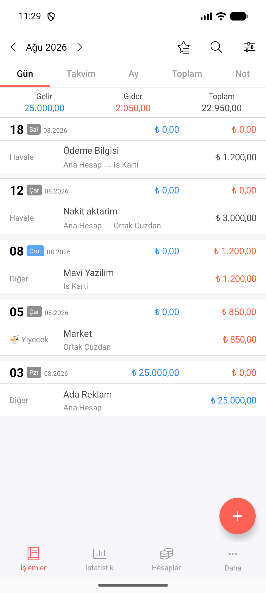
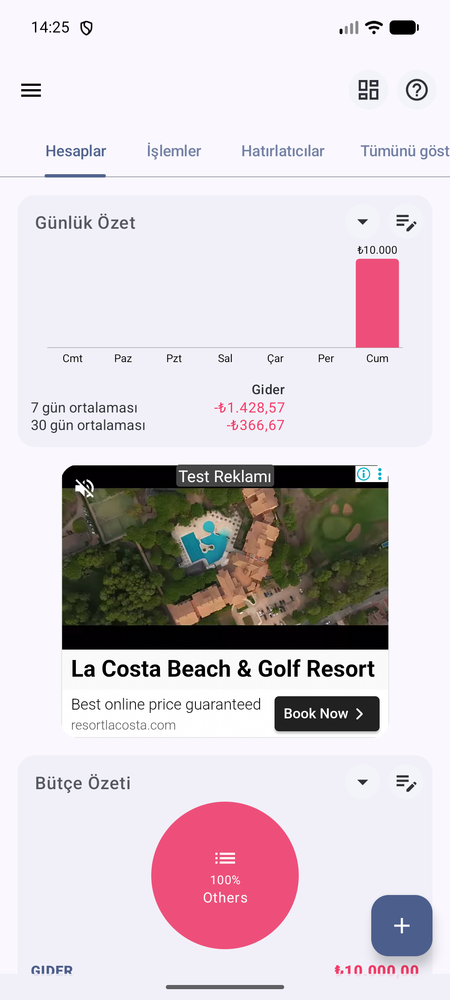

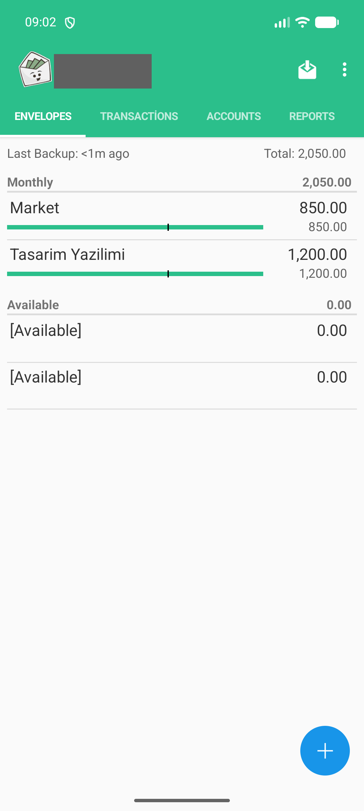
<!-- /kucukler -->

Şekil 3.1 · Veri girilmiş beş Android ana ekranı. Kareler ilk kurulum veya her yeniden açılıştaki varsayılan ekranı tek başına kanıtlamaz. Goodbudget hesap adı karartıldı.

<!-- pagebreak -->

## 3.1 İlk karşılaşma ve açılış ekranı

Uygulama ilk kez açıldığında kullanıcıdan ne isteniyor ve hangi ekran geliyor?

| Ürün ve platform | Görünen düzen | Dayanak ve sınır |
|---|---|---|
| Money Manager · Android | Koşumda kayıt/karşılama olmadan İşlemler › Gün açıldı; dil ve para birimi sorulmadı, varsayılan USD. | Canlı koşum · Kayıt: E0010 K00–K01; ilk açılış karesi yok (E1). |
| Bluecoins · Android | Karşılama, dil seçici ve Hadi Başlayalım; temiz ana ekranda sıfır bakiye ve İlk İşlemi Ekle (Şekil 3.2–3.3). | Canlı koşum · Kare: E0017, E0026. |
| Wallet · Android | İlk açılış bilinmiyor. Önceden açılmış hesapta Home › Accounts (Şekil 3.1). | Canlı koşum · Kayıt: E0014 K00; kare: E0276; ilk açılış görülmedi (E2). |
| Hesap Defterim · Android | Koşumda kayıt istenmedi; kullanım diyaloğu ve hazır defter. Diyalog Ücretli/Alınan, düğmeler Ödendi/Alındı diyor (Şekil 3.4). | Canlı koşum · Kayıt: E0007 K00; kare: E0135. |
| Goodbudget · Android | LOG IN / CREATE NEW HOUSEHOLD; izlenen yeni hane yolunda bütçe kurulumu, ardından LATER içeren kayıt ekranı, sonra ENVELOPES (Şekil 3.5). | Canlı koşum · Kare: E0106, E0115; kayıt: E0006 K00. LATER denenmedi; kurulum zorunluluğu çıkarılmaz. |
| Paraşüt / Logo İşbaşı · mobil | Paraşüt giriş ekranı geçilemedi; Logo İşbaşı giriş/kayıt yüzeyiyle sınırlı. | Canlı koşum · kayıt: E0011, E0009; giriş sonrası başlangıç bilinmiyor. |

<!-- kucukler -->
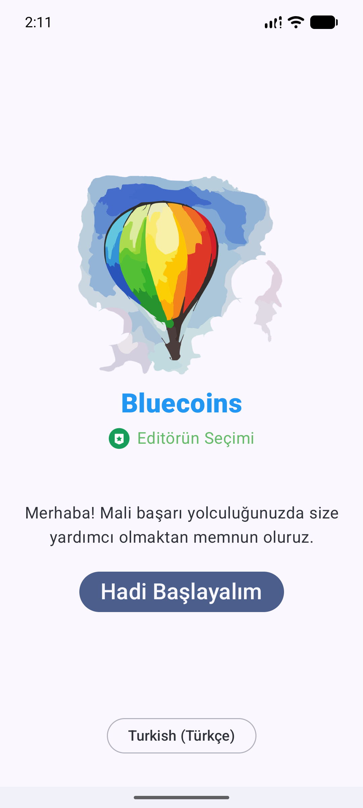
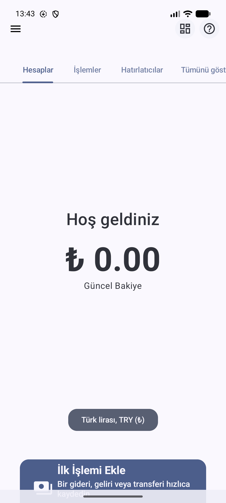
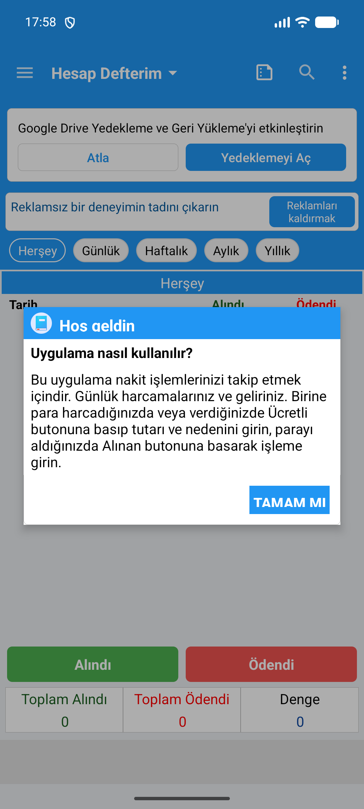
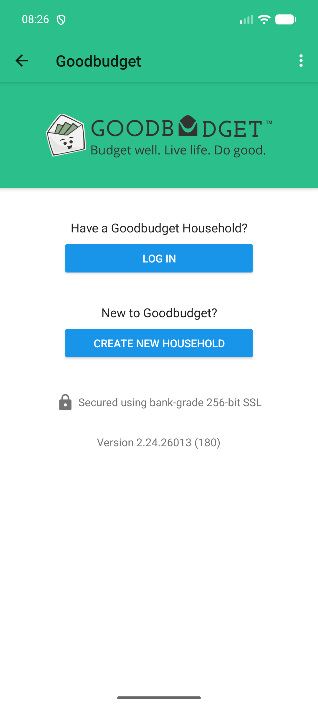
<!-- /kucukler -->

<!-- pagebreak -->

## 3.2 Ana gezinme

Uygulamanın bölümleri arasında nasıl geçiliyor?

| Ürün ve platform | Görünen düzen | Dayanak ve sınır |
|---|---|---|
| Money Manager · Android | İncelenen İşlemler, İstatistik, Hesaplar ve Daha/Ayarlar yüzeylerinde aynı dört alt sekme var. İşlemler içinde Gün, Takvim, Ay, Toplam, Not görünüyor (Şekil 3.1, 3.20–3.22). | Canlı koşum · Kare: E0228, E0231, E0236, E0254; incelenen dört ana bölüm. |
| Goodbudget · Android | üstte dört sabit sekme: ENVELOPES, TRANSACTIONS, ACCOUNTS, REPORTS (Şekil 3.1). | Canlı koşum · Kare: E0115; bu yüzeydeki yerleşim. |
| Bluecoins · Android | Üstte kaydırılan sekmeler ve sol menü. Son sekme adı ekrana sığmıyor. Menüde farklı simgeli iki Hesaplar kalemi var (Şekil 3.6). | Canlı koşum · Kare: E0018, E0103, E0084; iki Hesaplar hedefi açılmadı (E5). |
| Wallet · Android | Sol menüde finans bölümleri ve yardımcı araçlar; alt kısımda Dark mode ve Hide Amounts anahtarları. Home içinde Accounts ve Budgets & Goals (Şekil 3.7–3.8). | Canlı koşum · Kare: E0275, E0376, E0276; bütün menü hedefleri denenmedi. |
| Hesap Defterim · Android | Sol menüde özet, hesaplar, aktarım, bildiri, takvim, yedek ve yardımcı araçlar. Başlıkta defter seçici (Şekil 3.9). | Canlı koşum · Kare: E0171, E0136, E0137; açılışta seçili defter bilinmiyor (E4). |
| KolayBi · web | Solda modül paneli; üstte Güncel Durum, Stok Akışı ve Notlar. Daha yeni video menüsünde ayrıca Fatura Ödeme. | Kaynak · destek görseli E0211, video E0187; sürümler birleştirilmez. Şekil 3.16 ve 3.18, 3.4'te. |
| Paraşüt · masaüstü temsili | Menü alanları boş çizilmiş. | Kaynak · temsili çizim E0262; gezinme düzeni belirlenemiyor. |

<!-- kucukler -->
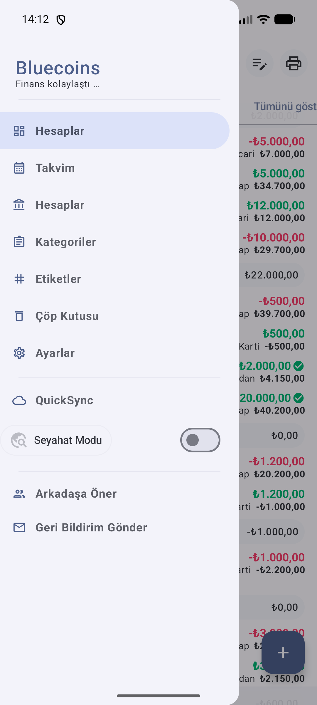

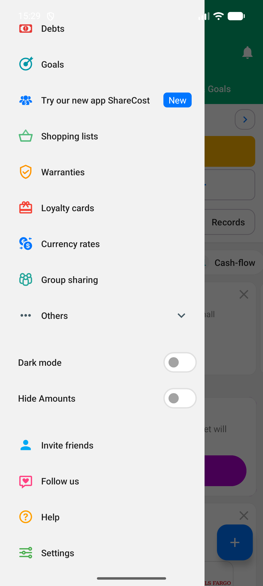
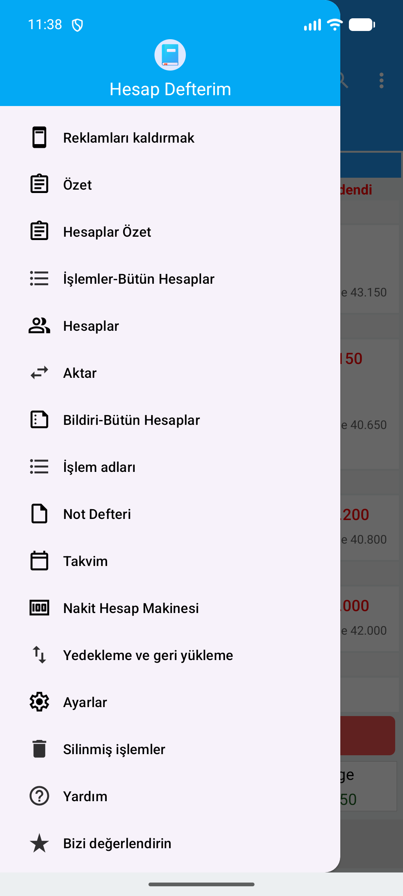
<!-- /kucukler -->

<!-- kucukler -->
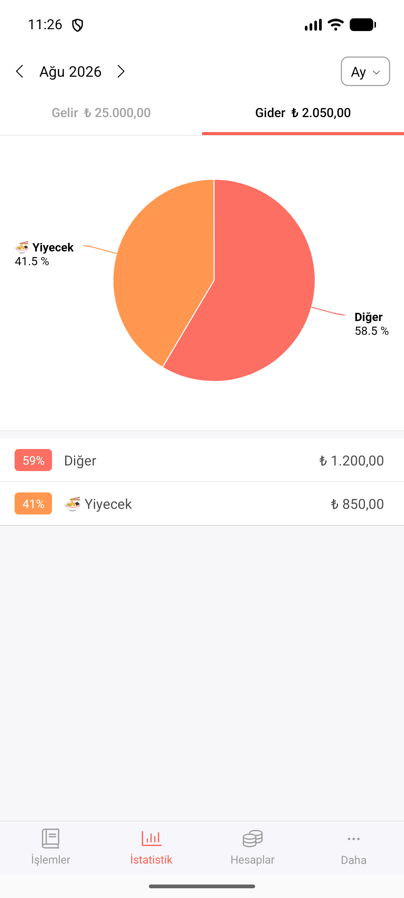
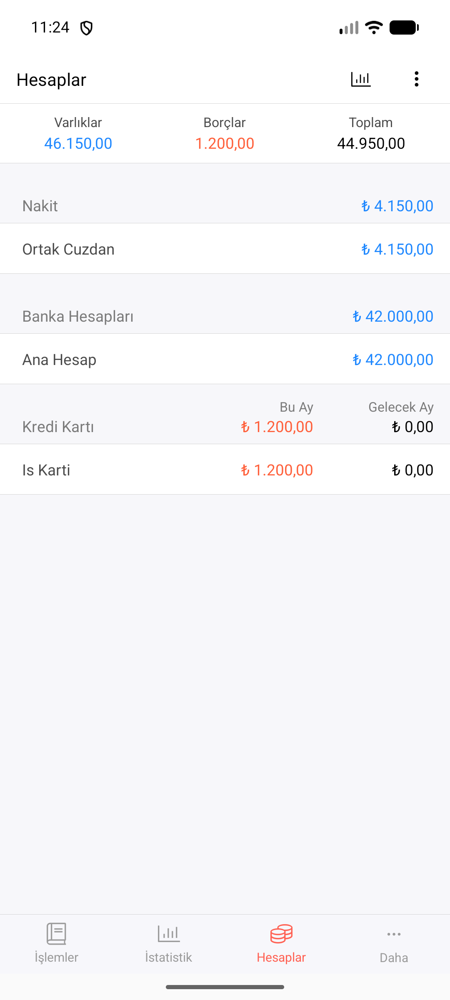
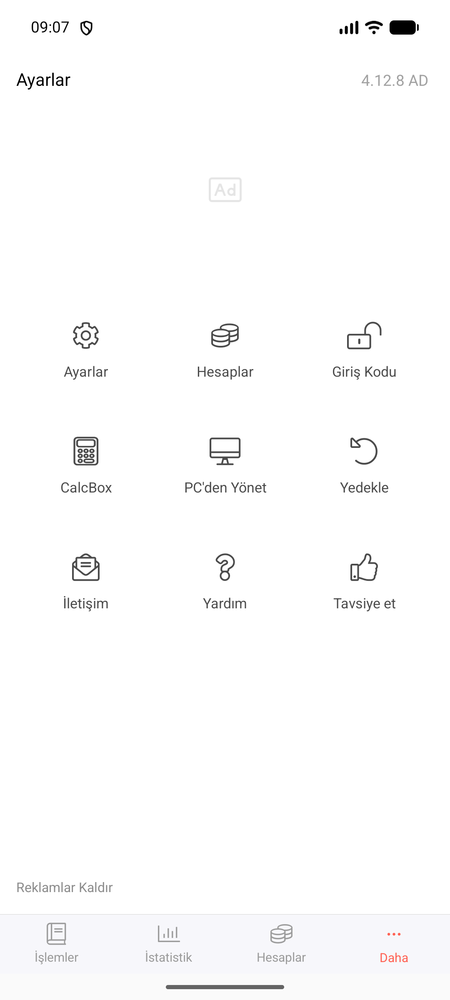
<!-- /kucukler -->

**Kanıt sınırı.** Şekil 3.20–3.22 aynı alt sekmeleri farklı ana bölümlerde doğrular; bütün alt formlarda görünürlük veya geçiş süresi ölçülmedi.

## 3.3 Ekleme eylemi

Yeni kayıt nereden başlatılıyor?

| Ürün ve platform | Görünen düzen | Dayanak ve sınır |
|---|---|---|
| Money Manager · Android | Sağ altta turuncu yuvarlak +. | Canlı koşum · kare E0228; Şekil 3.1. |
| Bluecoins · Android | Sağ altta +; temiz başlangıçta İlk İşlemi Ekle kartı. | Canlı koşum · kare E0103, E0026; Şekil 3.1, 3.3. |
| Wallet / Goodbudget · Android | Sağ altta mavi yuvarlak +. | Canlı koşum · kare E0276, E0115; Şekil 3.1. |
| Hesap Defterim · Android | Alındı / Ödendi düğmeleri; menüde Aktar. | Canlı koşum · kare E0137, E0171; Şekil 3.1, 3.9. |
| KolayBi · web | Pano sağ üstünde Hızlı İşlemler. | Kaynak · destek görseli E0211; kapalı menünün seçenekleri görülmedi. Şekil 3.16. |
| Paraşüt · masaüstü temsili | Kayıt başlatma kontrolü belirlenemiyor. | Kaynak · temsili çizim E0262; yeterli kanıt yok. |

Dört + düğmeli ürünün form karelerinde tür seçenekleri görülüyor (E0229, E0074, E0277, E0116; iddia 28). Varsayılan tür ve her kayıtta seçimi değiştirmek gerekip gerekmediği doğrulanmadı. Form düzeni Bölüm 5'te ele alınır. Hesap Defterim'de para yönü düğme adında görünür.

<!-- pagebreak -->

## 3.4 Ana ekranın bilgi sırası

Ana ekran hangi bilgiyi önce, hangisini sonra veriyor; bekleyen işler nerede görünüyor?

| Ürün ve platform | Görünen düzen | Dayanak ve sınır |
|---|---|---|
| Money Manager · Android | Ayın Gelir, Gider, Toplam sayıları; altında gün gruplu işlemler ve günlük özetler. Hesap bakiyeleri Hesaplar yüzeyinde (Şekil 3.1, 3.21). | Canlı koşum · Kare: E0228, E0236; ana ekran ve Hesaplar ayrı yüzeyler. |
| Bluecoins · Android | Örnek panoda Günlük Özet, reklam ve Bütçe Özeti; Ana Ekran ayarında kart anahtarları. Bekleyen işler Hatırlatıcılar sekmesinde tarih gruplu (Şekil 3.10–3.11). Dolu hesapta açılış sekmesi bilinmiyor. | Canlı koşum · Kare: E0103, E0025, E0056; kart anahtarlarının sonuç davranışı ölçülmedi (E7). |
| Wallet · Android | Hesap kartları, tanıtımlar; aşağıda Balance Trend, Upcoming planned payments ve Add more cards (Şekil 3.1, 3.12). | Canlı koşum · Kare: E0276, E0274; planlı kart yükleniyor görünümünde (E8). |
| Hesap Defterim · Android | Seçili defterin günlük listesi ve satır dengeleri; altta Toplam Alındı, Toplam Ödendi, Denge. Bu yüzeyde grafik/bekleyen iş alanı görülmedi (Şekil 3.1). Boş defterde yedek daveti ve reklam alanları var (Şekil 3.15). | Canlı koşum · Kare: E0137, E0136; özellik taraması E0007 B1 ile sınırlı. |
| Goodbudget · Android | Yedek zamanı, Total, Monthly zarfları ve Available. İki tutarın etiketi yok; kayda göre üst kalan, alt bütçe. Bekleyen iş alanı görülmedi (Şekil 3.1). | Canlı koşum · Kare: E0115; sayı anlamları E0006 K01 kaydına dayanır, kare tek başına ayırmaz (E6). |
| KolayBi · web | Nakit akışı grafiği, Tahsilat Ve Ödeme Özetleri, Günü Gelen İşlemler. | Kaynak · destek görseli E0211; video E0181, E0187. Demo veri; sürüm ve davranış doğrulanmadı. |
| Paraşüt · masaüstü temsili | Tahsilatlar ve Ödemeler halkaları, tarih ve gecikme uyarısı. | Kaynak · temsili çizim E0262; gerçek uygulama ekranı doğrulanmadı, mobil ekran değildir. |

<!-- kucukler -->
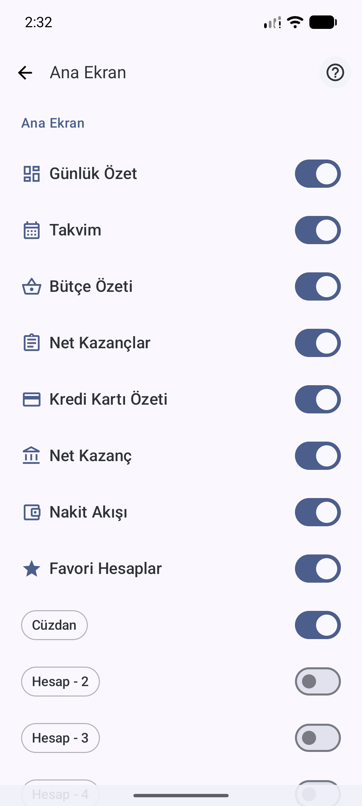
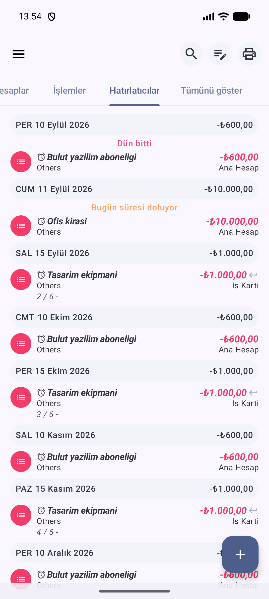

<!-- /kucukler -->

<!-- pagebreak -->

### Kaynak panolarının ayrıntıları

- **KolayBi** (web): ana ekranın adı Güncel Durum. Solda sabit bir modül menüsü var: Güncel Durum, Satış Yönetimi, Satın Alma Yönetimi, Genel Gider Yönetimi, Ürün ve Hizmetler, Cari Hesaplar, Finans, Projeler, Raporlar, Ek Özellikler, Abonelik, Destek, Ayarlar. Üstte Güncel Durum, Stok Akışı ve Notlar sekmeleri, sağ üstte Hızlı İşlemler açılır menüsü bulunuyor (Şekil 3.16).
- Pano üç bloktan oluşuyor: gelir ve gider için iki çizgili nakit akışı grafiği, altında Tahsilat Ve Ödeme Özetleri, sağda Günü Gelen İşlemler (Bugün, Yaklaşanlar, Tarihi Geçenler). Video karesinde özetler tahsilatlar ve ödemeler için üçer halka olarak görünüyor: Vadesi Gelmemiş, Vadesi Geçmiş, Vadesi Belirsiz. Günü Gelen İşlemler'de Faturalar, Genel Giderler ve Çalışan Maaşları satırları renkli sayaçlar taşıyor (Şekil 3.17).
- Üç kare panonun farklı görünümlerini gösteriyor. Destek sayfası karesinde grafiğin üstünde iş ortağı kutucukları ("Size Özel Ayrıcalıklar") ve sağda "KolayBi' Yolu Var!" bağlantıları var (Şekil 3.16). Eski video karesinde bunların yerinde bir takvim bulunuyor (Şekil 3.17). Daha yeni video karesinde menüde ayrıca Fatura Ödeme kalemi var (Şekil 3.18). Hangisinin bugünkü sürüm olduğu doğrulanmadı. Destek sayfası ve yeni video karelerinde sağda "Mobil Uygulamaya Giriş Yap" kartı görünüyor; mobil uygulamanın içi görülmedi.
- **Paraşüt**: tanıtım videosunun "Cari Hesap Takibi" karesinde Güncel Durum ekranı iki bloktan oluşuyor. Tahsilatlar için TAHSİL EDİLECEK, GECİKMİŞ ve FATURA YOK; Ödemeler için ÖDENECEK, ÖDEME YOK ve PLANLANMIŞ halkaları var; sağda "BUGÜN - 22 EYLÜL" ve "4 GÜN GECİKTİ" uyarısı duruyor (Şekil 3.19). Kare bir tanıtım çizimidir: menü alanları boş çizilmiş, tahsil edilecek ve gecikmiş halkaları aynı tutarı gösteriyor. Gerçek uygulama ekranı olduğu doğrulanmadı. Mobil uygulamada yalnız giriş öncesi tanıtım ekranları görüldü.

<!-- kucukler -->
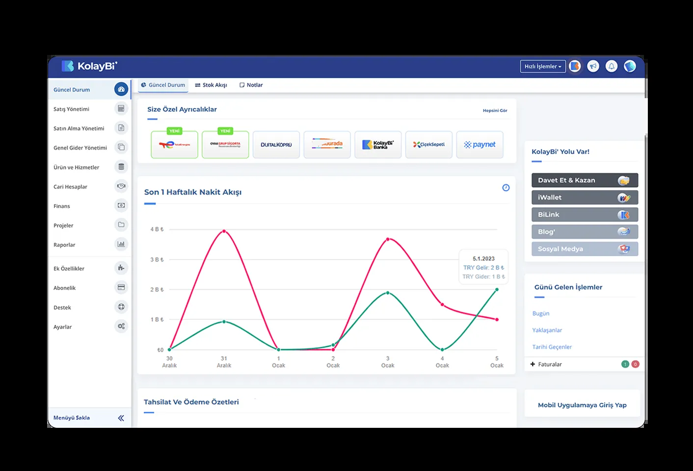
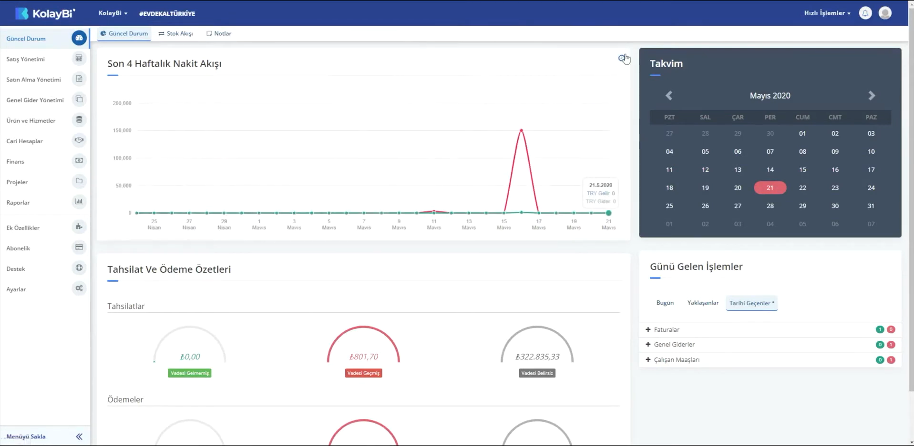
<!-- /kucukler -->

<!-- kucukler -->
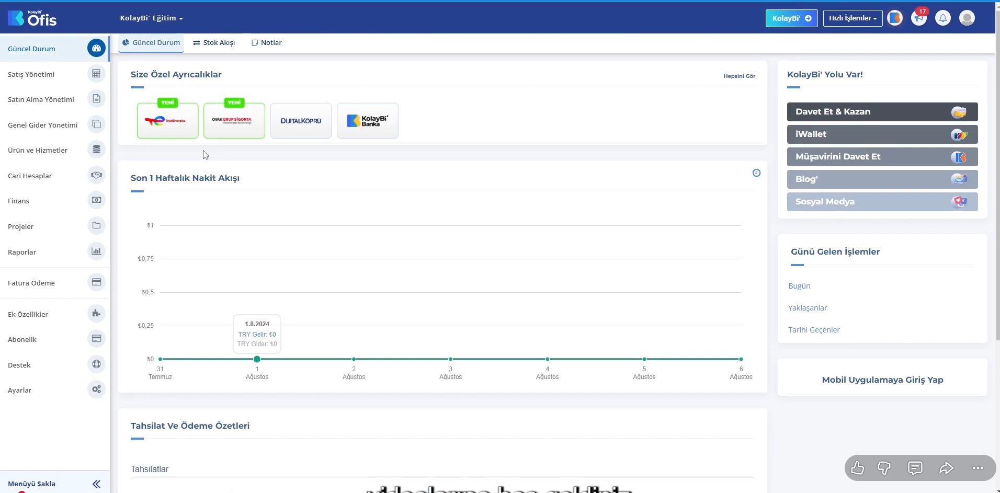

<!-- /kucukler -->

**Önemli fark ve sınır.** Wallet'ta da planlı ödeme kartı görülüyor; bekleyen işler yalnız kaynak panolarına özgü sayılamaz. KolayBi kaynaklarındaki farklı sürümler tek güncel ekran gibi birleştirilemez. Masaüstü ve mobil yüzeyler eşdeğer alan koşullarında incelenmedi.

<!-- pagebreak -->

## 3.5 Boş ana ekran

Temiz başlangıçta veya seçili dönemde kayıt yokken ne gösteriliyor?

| Ürün ve platform | Görünen düzen | Dayanak ve sınır |
|---|---|---|
| Money Manager · Android | kayıtsız bir ayda liste yerine bir çizim ve "Veri yok." yazısı; ne yapılacağına dair metin yok (Şekil 3.13). Bu kare ilk açılış değil; veri girilmiş uygulamada boş kalan Eylül ayıdır. | Canlı koşum · Kare: E0227; boş dönem, ilk kurulum değil. |
| Bluecoins · Android | boş kartların her birinde "Bu dönemde hiçbir işlem yok." yazıyor (Şekil 3.14). Temiz başlangıçta ayrıca İlk İşlemi Ekle kartı görünüyor (Şekil 3.3). | Canlı koşum · Kare: E0018, E0026; boş kart ve temiz başlangıç ayrı durumlar. |
| Hesap Defterim · Android | yalnız Tarih / Alındı / Ödendi başlık satırı ve sıfır toplamlar; yönlendirme metni yok (Şekil 3.15). | Canlı koşum · Kare: E0136; boş defter. |
| Wallet / Goodbudget · Android | Boş ana ekran görülmedi: Wallet dolu hesapla, Goodbudget bütçe kurulumu sonrası incelendi. | Canlı koşum · Kayıt: E0014 K00, E0006 K00; boş ana ekran görülmedi (E3). |

<!-- kucukler -->

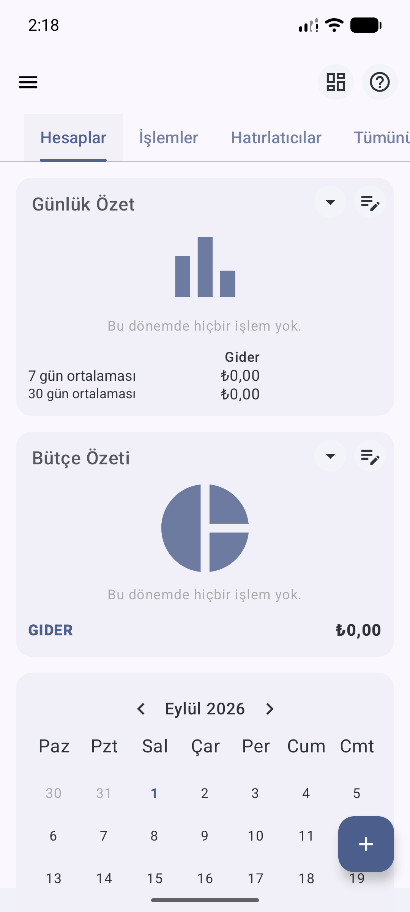

<!-- /kucukler -->

**Kanıt sınırı.** Boş dönem, boş defter ve temiz kurulum farklı durumlardır. Kaynak panolarındaki sıfır demo değerleri ilk kullanım deneyimini kanıtlamaz. KolayBi, Paraşüt, Logo İşbaşı ve QuickBooks için boş ana ekran görülmedi.

<!-- pagebreak -->

### Bölüm özeti

- Ana gezinmede sabit sekmeler, kaydırılan sekmeler, açılır menüler ve kaynaklarda web yan paneli görülüyor (3.2).
- Dört mobil ürün + simgesi, Hesap Defterim yön adları taşıyan düğmeler kullanıyor. Zorunlu tür seçimi adımı sayısı doğrulanmadı (3.3).
- Ana ekranın önce sunduğu bilgi dönem hareketleri, hesaplar, zarflar veya vade özetleri olabiliyor. Wallet planlı ödeme kartı yükleniyor görünümünde (3.4).
- Goodbudget'ın izlenen yeni hane yolu kurulum içeriyor; atlama denenmedi. Wallet'ın ilk açılışı bilinmiyor (3.1).
- Boş dönem ile temiz başlangıç farklı kanıtlardır (3.5). Bu gözlemler bir ürün sıralaması veya kullanılabilirlik ölçümü değildir.

### Kanıt dizini

| Şekil | Kimlik | Uygulama · koşum | Özgün dosya |
|---|---|---|---|
| 3.1 | E0228 | Money Manager · Faz 1, 10 Eylül 2026 | money-manager/03-dolu-ana-ekran.png |
| 3.1 | E0103 | Bluecoins · Faz 7, 11 Eylül 2026 | bluecoins/f7-52-nav-check.png |
| 3.1 | E0276 | Wallet · Tur 1 | wallet-budgetbakers/03-dolu-ana-ekran.png |
| 3.1 | E0137 | Hesap Defterim · Tur 1, 10 Eylül 2026 | hesap-defterim/03-dolu-ana-ekran.png |
| 3.1 | E0115 | Goodbudget · 11 Eylül 2026 · hesap adı karartıldı | goodbudget/08-envelopes-filled-home.png |
| 3.2 | E0017 | Bluecoins · Tur 1 | bluecoins/01-ilk-acilis.png |
| 3.3 | E0026 | Bluecoins · Faz 3, 10 Eylül 2026 | bluecoins/10-fresh-bos-ana-ekran.png |
| 3.4 | E0135 | Hesap Defterim · Tur 1, 10 Eylül 2026 | hesap-defterim/01-ilk-acilis-hosgeldin.png |
| 3.5 | E0106 | Goodbudget · 11 Eylül 2026 | goodbudget/01-ilk-acilis.png |
| 3.6 | E0084 | Bluecoins · Faz 7, 11 Eylül 2026 | bluecoins/f7-33-menu2.png |
| 3.7 | E0275 | Wallet · Tur 1 · hesap sahibinin adı karartıldı | wallet-budgetbakers/02b-menu.png |
| 3.8 | E0376 | Wallet · Faz 7, 11 Eylül 2026 | wallet-budgetbakers/f7-55-menu-scroll.png |
| 3.9 | E0171 | Hesap Defterim · 12 Eylül 2026 | hesap-defterim/36-drawer-menu-ust.png |
| 3.10 | E0025 | Bluecoins · Tur 1 | bluecoins/09-ozgun-ozellik.png |
| 3.11 | E0056 | Bluecoins · Faz 7, 11 Eylül 2026 | bluecoins/f7-05-hatirlaticilar.png |
| 3.12 | E0274 | Wallet · Tur 1 | wallet-budgetbakers/00-magaza.png |
| 3.13 | E0227 | Money Manager · Faz 1, 10 Eylül 2026 | money-manager/02-bos-ana-ekran.png |
| 3.14 | E0018 | Bluecoins · Tur 1 | bluecoins/02-bos-ana-ekran.png |
| 3.15 | E0136 | Hesap Defterim · Tur 1, 10 Eylül 2026 | hesap-defterim/02-bos-ana-ekran.png |
| 3.16 | E0211 | KolayBi · destek sayfası görseli, 12 Eylül 2026 erişim, demo veri | kolaybi/d24-destek-guncel-durum-panosu.png |
| 3.17 | E0181 | KolayBi · tanıtım videosu karesi, demo veri | kolaybi/d33-video-guncel-durum-panosu.png |
| 3.18 | E0187 | KolayBi · daha yeni video karesi, sürüm doğrulanmadı | kolaybi/d39-guncel-arayuz-2026.png |
| 3.19 | E0262 | Paraşüt · tanıtım videosu karesi | parasut/04-video-cari-hesap-durumu.png |
| 3.20 | E0231 | Money Manager · Faz 1, 10 Eylül 2026 | money-manager/07-rapor-agustos.png |
| 3.21 | E0236 | Money Manager · Faz 1, 10 Eylül 2026 | money-manager/12-hesaplar-kart-borcu-bu-ay.png |
| 3.22 | E0254 | Money Manager · ek koşum | money-manager/30-ayarlar-izgarasi.png |

Şekil 3.1–3.15 ve 3.20–3.22 canlı koşum kareleri; 3.16–3.18 destek/video kaynakları; 3.19 temsili tanıtım çizimidir. Özgün dosyalar araştırmanın kanitlar/ klasöründedir; SHA-256 değerleri [kaynak dizininde](kaynaklar.md). Ekran görüntüsü olmayan ifadeler gözlem formlarındaki koşum kayıtlarına dayanır: E0010 Money Manager, E0005 Bluecoins, E0014 Wallet, E0007 Hesap Defterim, E0006 Goodbudget. Arayüz etiketleri ekranda göründüğü dilde yazıldı.
